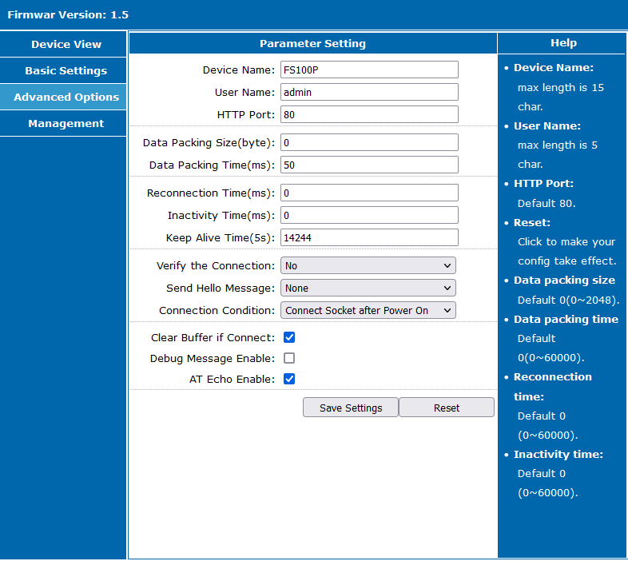

Convert an Alarmdecoder AD2USB to use an Ethernet to serial converter

### Items needed

- Alarm Decoder [AD2USB](https://www.alarmdecoder.com/catalog/product_info.php/products_id/29)
- [FS100P](https://www.aliexpress.com/item/32963270624.html) Ethernet to Serial converter
- [Mini360](https://www.aliexpress.com/item/32411154908.html) DC-DC Buck converter to power the FS100P (taking 12v from the panel down to 3.3v)
- Capton or generic equivalent tape for insulating the buck converter and providing strain relief.

### Wiring

On the AD2USB there are two surface mount pads for an interface connector, you can purchase these or solder directly to the pins that provide RX/TX on the board.  
These are on the connector labeled "CON3" and are the pads on the uppermost right side when the screw post terminals are pointing down.

I soldered mine and then used capton tape to help prevent the wires from peeling off the pads from the board.

I may convert this to the soldered headers with some ribbon cable in the future.

Sean from Alarmdecoder supplied me with these diagrams and part number of the connector:

**SBH31-NBPB-D05-SP-BK**

Wire up the RX on the AD2USB to the TX, and the TX on the AD2USB to the RS on the FS100P

I soldered the 12v posts from the underside of the AD2USB directly to the input side of the Mini360, setting the variable output to exactly 3.3v.  I tested a wide range of input voltages using my bench supply, from 10v up to 14v and the output remained a solid 3.3v.  
Nominal voltage from my alarm panel was 13.8v.

I then soldered the output of the Mini360 to the FS100P and wired it into my alarm panel.

The heartbeat LED was flashing on the AD2USB and I saw the Ethernet Link light come on, so I knew all was well.

### FS100P setup

The next step was to get the FS100P to use DHCP.

This unit comes from the factory configured for 192.168.0.7 so place your computer temporarily on the ip address 192.168.0.22 for example, so you can login to the web interface and change the network settings from static to DHCP.  If your network is already on 192.168.0.x you may have to remove whatever device is on 192.168.0.7 for this to work or use a cross over cable so you don't create IP conflicts. (Remember to change your IP back when you're done.)

Login to the web interface on 192.168.0.7 with admin/admin - sometimes you have to do this twice - and click on basic config, then check the "Use DHCP" Box or configure your own static IP address.  

While you're there make sure the Socket Type is "TCP Server"
Remote host should be blank
Remote port can be whatever you want, its not used.
Local port can also be whatever you want, but you'll have to remember what it is for connecting to Home Assistant in my case I used the default 20108

Click on Advanced settings
I changed:
- Verify Connection == No
- Send Hello Message == None
- Connections Condition == Connect Socket after power on

I found that while I was playing with the FS100P without anything attached to serial, that the noise from the floating RX/TX would print out garbage, once it was hooked up correctly, the connection was noise free.

**Note that the device will block more than one connection**

This means whatever connects to this unit first "wins" and will lock the connection open. 
Beware of the home assistant nmap scanner it can block HA from connecting to the serial socket, I suggest excluding the IP of the unit from the nmap (or any other) device scanner.

This document is a work in progress.

Note that you may ruin your devices if you open them up and make these unauthorized changes, don't expect the manufacturer to warranty your mistakes.
This is what worked for me, your mileage may vary... 
